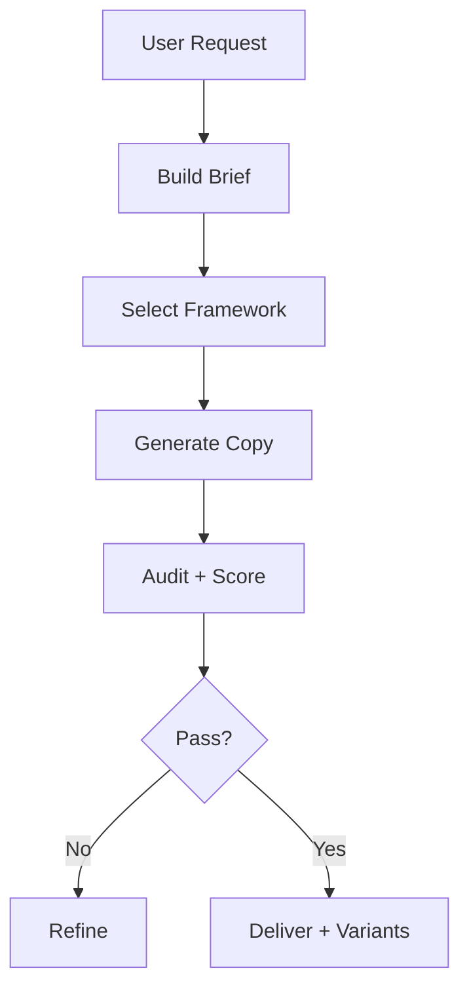

# Copywriting

Write clear. Persuade ethically. Convert consistently.

---

## When to Use This Skill

Use when user:

- Needs marketing copy (ads, landing pages, emails, social)
- Needs product descriptions or SaaS messaging
- Wants UX microcopy (buttons, onboarding, errors)
- Asks to improve or rewrite existing copy
- Wants A/B testing variations
- Needs localization-ready content

---

## Core Principle

Copy = **Strategy → Structure → Message → Proof → Action**

Not writing exercise. Decision system.

---

## Workflow



---

## Step 1 — Build Brief

Minimum required:

```yaml
goal: "conversion | awareness | retention"
audience:
  who: ""
  context: ""
  job:
    functional: ""
    emotional: ""
    social: ""
offer:
  product: ""
  value: ""
  cta: ""
channel:
  type: ""
  constraints: ""
language: ""
locale: ""
```

If missing → ask. No guessing.

---

## Step 2 — Select Framework

Choose ONE primary.

| Situation | Framework |
|----------|----------|
| General marketing | AIDA |
| Pain-driven | PAS |
| Product clarity | FAB |
| Messaging strategy | JTBD |
| Brand narrative | StoryBrand |

Always pair with: **4Cs (clear, concise, compelling, credible)**

---

## Step 3 — Generate Copy

Always produce:

- 1 Primary version (V1)
- 2–5 Variants (V2–Vn)
- Hypothesis per variant

### Structure by Channel

**Landing Page**
- Headline
- Subheadline
- Value section
- Proof
- CTA

**Ad**
- Hook
- Body (1–2 lines)
- CTA

**Email**
- Subject (3 variants)
- Preheader (2)
- Body
- CTA

**Product**
- 1-line value
- Bullet benefits
- Feature → benefit

**UX**
- Title
- Helper text
- CTA
- Errors (2)
- Success

---

## Step 4 — Variants (Critical Rule)

Each variant = **one change only**

Test dimensions:
- Hook
- Proof
- CTA
- Tone
- Structure

Example:

```
V2:
Change: CTA
Hypothesis: stronger verb → higher CTR
```

---

## Step 5 — Evaluation

Score 0–5 each:

| Criteria | Weight |
|----------|--------|
| Clarity | 15 |
| Relevance | 15 |
| Value | 12 |
| Credibility | 15 |
| Persuasion | 10 |
| Tone | 8 |
| Inclusivity | 10 |
| Accessibility | 8 |
| Localization | 7 |

**Total: 100**

### Thresholds

- ≥85 → ship
- 70–84 → refine
- <70 → rewrite

---

## Step 6 — Claims Audit

Every claim must be:

- True
- Verifiable
- Non-misleading

If proof missing:

```
Rewrite:
"designed to help"
"can improve"
"typically"
```

Never invent numbers.

---

## Step 7 — Localization

Make copy global-ready:

- No idioms
- No slang
- No cultural assumptions
- Neutral tone
- Simple structure

---

## Step 8 — Accessibility

- Short sentences
- Plain language
- Clear CTAs (no “click here”)
- Helpful error messages

---

## Prompt Templates

### Generate Copy

```
Write conversion-focused copy:

Product: {product}
Audience: {audience}
Goal: {goal}
Channel: {channel}

Use {framework}

Output:
- Primary version
- 3 variants
- Hypothesis per variant
```

---

### A/B Variants

```
Generate 5 variants.

Rules:
- 1 change per variant
- Include hypothesis
- Target: {metric}
```

---

### Product Description

```
Convert specs into:

- Value proposition
- 5 bullet benefits
- Feature → benefit mapping
- CTA
```

---

### UX Microcopy

```
Write UX copy for {flow}:

- Title
- Helper text
- CTA
- 2 errors
- Success message
```

---

### Localization

```
Adapt for {locale}:

- Remove idioms
- Adjust tone
- Keep intent
- Provide change log
```

---

## Safety Rules

### Never:

- Invent claims
- Mislead users
- Use fake urgency
- Hide conditions
- Use dark patterns

### Always:

- Be honest
- Be clear
- Respect user autonomy

---

## Output Format

```yaml
framework: ""
copy:
  primary: {}
  variants: []
hypotheses: []
claims_audit: []
score: {}
notes:
  localization: []
  accessibility: []
```

---

## Usage Notes

- Start with brief → always
- One framework → clarity
- Variants → learning, not noise
- Clarity > cleverness
- Proof > persuasion tricks

---

## Version

```yaml
version: 1.0.0
status: stable
```

---

## Summary

This skill turns copywriting into:

**System → Not guesswork**

- Structured input
- Framework-driven output
- Measurable quality
- Ethical persuasion
- Global readiness
